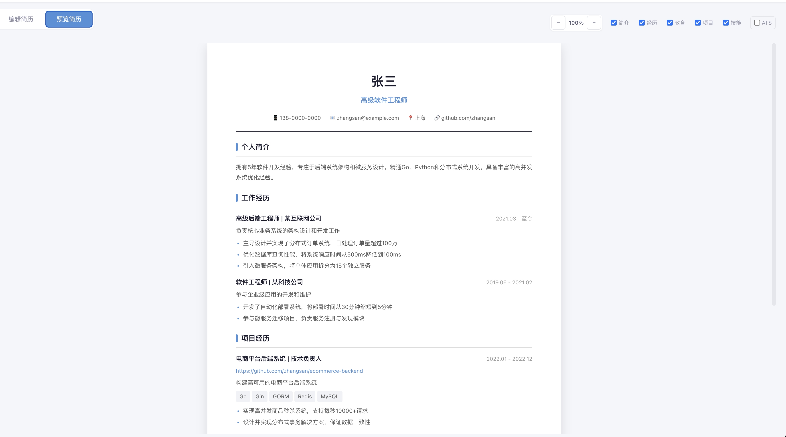
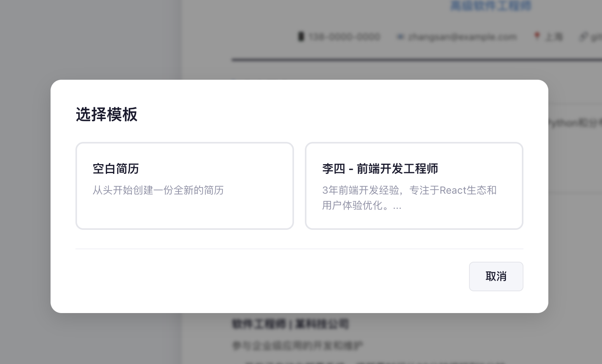
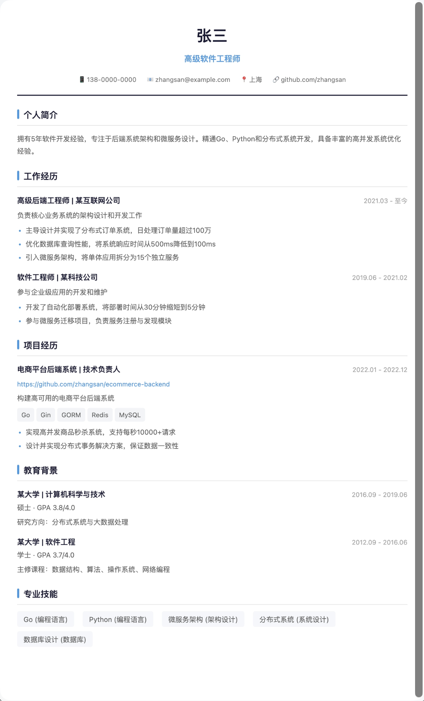

# 📄 ResumeCraft · 超级简历

> 在线简历生成器 — Web 界面编辑、实时预览、多模块管理、一键 PDF 下载

[](LICENSE)
[](https://react.dev)
[](https://www.typescriptlang.org)
[](https://vitejs.dev)

<p align="center">
  
  
</p>

## ✨ 功能

- **📝 可视化编辑** — 个人信息、工作经历、教育背景、项目经历、技能五大模块，可折叠表单编辑
- **👁️ 实时预览** — 编辑同时右侧 A4 纸实时刷新，所见即所得
- **📥 PDF 导出** — 基于 html2pdf.js 一键生成高质量 A4 PDF，排版精确
- **💾 自动保存** — 2 秒防抖自动写入 localStorage，刷新不丢失。支持手动保存多份简历
- **📤 JSON 导入/导出** — 备份简历数据、跨设备迁移
- **🔍 预览缩放** — 0.5× ~ 1.5× 缩放，小屏也能看清全貌
- **👁️ 模块可见性** — 一键隐藏/显示任意模块，生成不同侧重点的简历版本
- **🤖 ATS 友好** — 一键切换纯文本联系人格式，确保 Applicant Tracking System 正确解析
- **⌨️ 键盘快捷键** — `Ctrl+S` 保存 · `Ctrl+E` 导出 PDF · `Ctrl+Z/X/0` 缩放
- **📱 响应式** — 桌面端优先，平板和手机端自适应

## 🚀 快速开始

### 前端（React + TypeScript + Vite）

```bash
# 安装依赖
npm install

# 启动开发服务器
npm run dev

# 构建生产版本
npm run build
```

浏览器打开 `http://localhost:3000` 即可使用。

### 后端（Go + Gin + GORM，可选）

前端默认使用 localStorage 存储，无需后端即可完整运行。

如需多用户系统（注册/登录/云端存储），可启动 Go 后端：

```bash
cd server
go mod tidy
go run .           # 启动在 :8080
```

后端提供 RESTful API（`/api/v1/`），支持 SQLite（默认）或 MySQL。

## 📁 项目结构

```
resumecraft/
├── src/                          # React 前端源码
│   ├── main.tsx                  # 入口
│   ├── App.tsx                   # 根组件（状态管理、快捷键、导入导出）
│   ├── index.css                 # 全局样式
│   ├── html2pdf.d.ts             # html2pdf.js 类型声明
│   ├── components/
│   │   ├── ResumeEditor.tsx      # 编辑器组件（5 大模块表单）
│   │   └── ResumePreview.tsx     # 预览组件（A4 渲染 + PDF 导出）
│   ├── types/
│   │   └── resume.ts             # TypeScript 类型 & 默认数据
│   └── data/
│       └── examples.ts           # 示例简历数据
├── server/                       # Go 后端（可选）
│   ├── main.go                   # Gin 路由 + CORS
│   ├── config/config.go          # 配置
│   ├── db/                       # GORM 模型 + 数据库初始化
│   ├── auth/                     # JWT 认证
│   └── handlers/                 # 简历 CRUD + 区块管理
├── index.html                    # Vite 入口 HTML
├── vite.config.ts                # Vite 配置
├── tsconfig.json                 # TypeScript 配置
├── package.json                  # 依赖 & 脚本
├── .gitignore
├── LICENSE                       # MIT
└── README.md
```

## 🛠 技术栈

| 层级 | 技术 |
|------|------|
| 框架 | React 18 |
| 语言 | TypeScript 5 |
| 构建 | Vite 4 |
| PDF | html2pdf.js (html2canvas + jsPDF) |
| 后端 (可选) | Go + Gin + GORM |
| 存储 | localStorage / SQLite / MySQL |

## 🎨 数据模型

```typescript
interface ResumeData {
  id: string;
  personal: {
    name: string;
    title: string;
    phone: string;
    email: string;
    location: string;
    github?: string;
    linkedin?: string;
    website?: string;
    summary: string;
  };
  experiences: Experience[];
  education: Education[];
  projects: Project[];
  skills: Skill[];
}
```

## 📸 截图

| 编辑器 | 预览 |
|--------|------|
|  |  |

| 模板选择 | PDF 导出 |
|----------|----------|
|  |  |

> 运行 `npm run dev` 后在浏览器中截取上述截图，保存至 `screenshots/` 目录即可替换占位。

## ⌨️ 快捷键

| 快捷键 | 操作 |
|--------|------|
| `Ctrl + S` | 保存简历 |
| `Ctrl + E` | 导出 PDF |
| `Ctrl + Z` | 预览缩小 |
| `Ctrl + X` | 预览放大 |
| `Ctrl + 0` | 缩放重置 (100%) |

## 🤝 贡献

欢迎 Issue 和 Pull Request。

```bash
# 开发流程
git clone https://github.com/luanshuo/resumecraft.git
cd resumecraft
npm install
npm run dev
```

提交前请确保 `npm run build` 通过。

## 📄 License

MIT © ResumeCraft Contributors

---

**ResumeCraft** — 让写简历像填表一样简单 ✨
